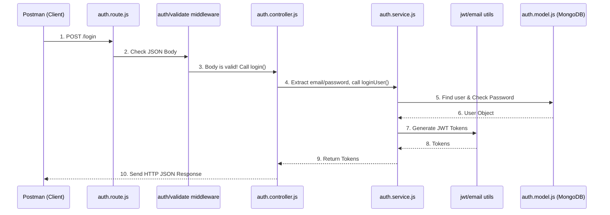

# Architecture Walkthrough: The Authentication Module

This project is built using a very clean, professional architecture known as the **Controller-Service-Model** pattern. 

This design keeps everything organized so that if you ever need to change your database, you don't have to rewrite your HTTP routes, and vice versa.

## 1. The Big Picture (How files are wired together)

Here is a visual representation of how a single request from Postman flows through your files:

---

## 2. File-by-File Breakdown

Let's look at exactly what each file does and who it talks to. Think of this like a restaurant.

### 🚦 `auth.route.js` (The Host / Traffic Cop)
This is the front door. When a request comes in from `app.js`, it hits this file.
- **What it does:** It maps URLs (like `/register` or `/login`) to specific functions. 
- **Who it talks to:** It imports **Middlewares** (to check the request before letting it in) and **Controllers** (to hand the request off to).
- **Wiring example:** `router.post("/login", validateMiddleware(loginSchema), controller.login)` 
  - *Translation:* "If someone POSTs to `/login`, first run `validateMiddleware`. If that passes, hand it to `controller.login`."

### 🛡️ `validate.middleware.js` & `dto/*` (The Bouncer)
Before the request gets any further, it is stopped here.
- **What it does:** Uses Joi schemas (from the `dto` folder) to look at `req.body`. If the user forgot to send an email, or the password is too short, the middleware throws an error instantly (Status 400). If it's perfect, it calls `next()` to let the request proceed.

### 👔 `auth.controller.js` (The Waiter)
The controller handles the HTTP layer. It speaks "Internet".
- **What it does:** It takes the incoming HTTP request (`req`), grabs the data out of it (like `req.body.email`), and passes that data to the Service. When the Service finishes, the Controller takes the result and formats it into an HTTP response (Status 200, JSON, Cookies).
- **Who it talks to:** It imports functions exclusively from `auth.service.js`. It does **not** talk to the database directly. It also uses `ApiResponse` to send nice JSON back to Postman.

### 🧑‍🍳 `auth.service.js` (The Chef / The Brains)
This is where the actual "Business Logic" lives. This file doesn't care about HTTP, `req`, or `res`. It just takes raw data and does the heavy lifting.
- **What it does:** It runs the core logic. (e.g., checking if an email is taken, comparing passwords, hashing tokens).
- **Who it talks to:** It talks to **EVERYTHING** else. 
  - It imports the **Model** (`auth.model.js`) to read/write to the database.
  - It imports **Utils** (`jwt.utils.js`) to make tokens.
  - It imports **Config** (`email.js`) to send emails.
  - It throws custom **ApiErrors** (`api-error.js`) if business rules are broken.

### 🗄️ `auth.model.js` (The Database / The Pantry)
This is the lowest layer of your app.
- **What it does:** It defines the exact shape of a User in MongoDB. It enforces rules (like `unique: true`).
- **Secret Power:** It has a `pre('save')` hook. Whenever `auth.service.js` calls `user.save()`, this file secretly intercepts it, uses `bcrypt` to encrypt the password, and *then* saves it. This guarantees no plain-text passwords ever enter your DB.

### 🛠️ `common/utils/*` (The Helpers)
These are standalone helper files that any part of your app can use.
- **`jwt.utils.js`:** Responsible for the math behind creating and verifying JSON Web Tokens.
- **`api-error.js`:** A custom Error class. Instead of normal errors that crash the app, these errors contain HTTP status codes (like 401 Unauthorized or 409 Conflict) so your global error handler knows exactly how to respond to Postman.
- **`Api-Response.js`:** A quick formatting tool so all your success responses look identical (e.g., `{ status: "success", data: ... }`).

---

## 3. Real Example: The `/logout` Flow
Let's trace the exact code path for Logout:

1. Postman sends a request to `/auth/logout` with a Bearer Token.
2. **`auth.route.js`** sees `/logout`. It sends the request to `authMiddleware`.
3. **`auth.middleware.js`** grabs the token from the headers, decodes it using `jwt.utils.js`, finds the `id` inside it, attaches it to `req.user`, and calls `next()`.
4. **`auth.route.js`** then passes the request to `controller.logOut`.
5. **`auth.controller.js`** takes `req.user.id` and calls `logOutUser(req.user.id)`.
6. **`auth.service.js`** receives the ID. It calls `User.findByIdAndUpdate()` (talking to `auth.model.js`) to delete the refresh token. It returns a success message.
7. **`auth.controller.js`** gets the success message back and uses `ApiResponse.success` to send a beautiful 200 OK JSON response back to Postman.
